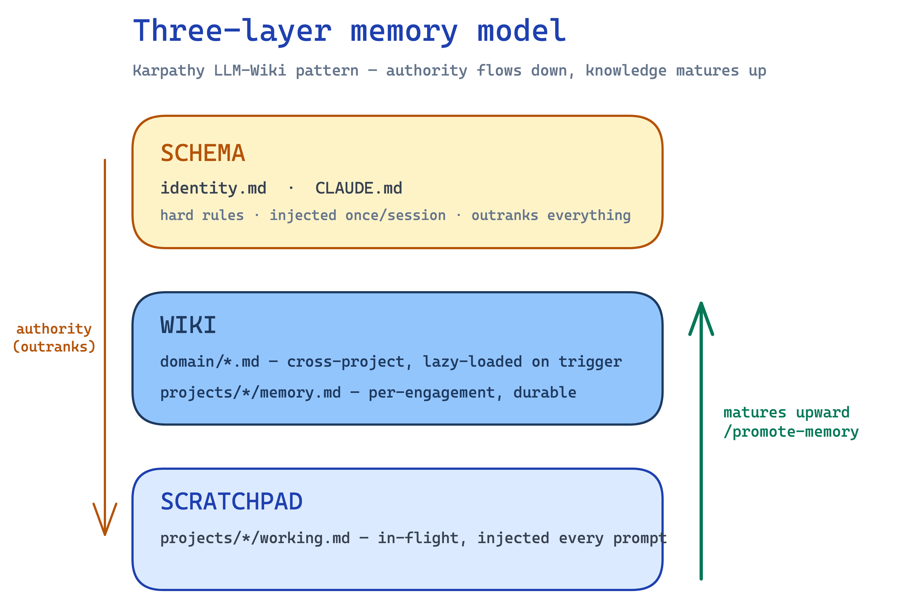
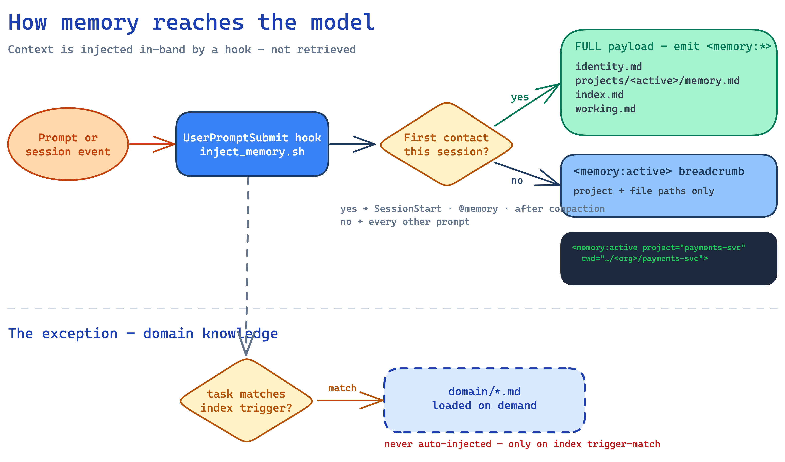
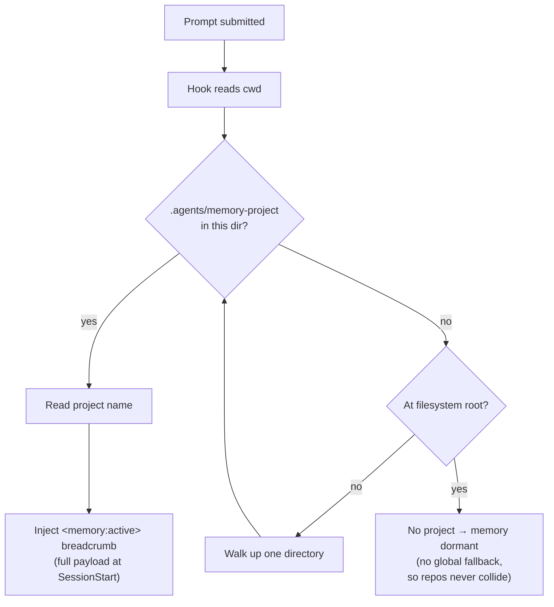
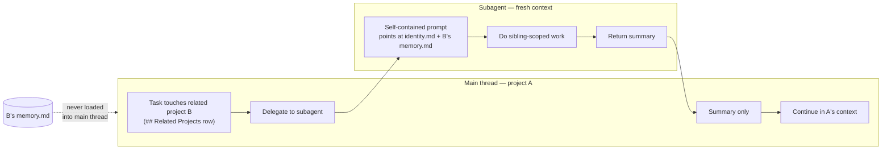
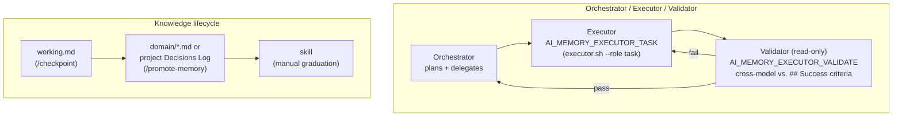
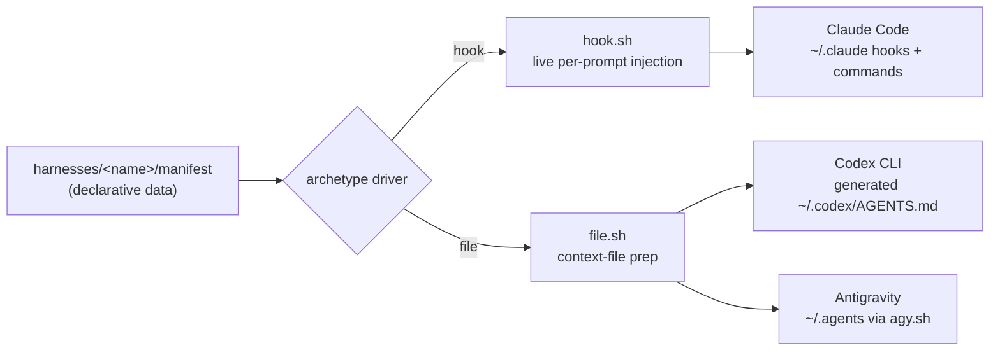

# Showcase — a guided tour of the memory system

> A narrative walkthrough for engineers evaluating or adopting the system. Where the
> other `docs/` pages are **reference**, this is the **tour**: it tells the story of
> *memory that compounds across sessions and repos with no database and no retrieval*,
> and points to the reference pages for depth. It doubles as the script behind the
> live demo — see the companion **[demo runbook](demo-runbook.md)**.

---

## Feature summary — what the application provides

Everything below is plain markdown + shell; no database, daemon, or MCP server. The `§`
column points to where each capability is toured.

**Memory & context**
| Feature | What it gives you | Entry point | § |
|---|---|---|---|
| Three-layer store | Schema / wiki / scratchpad on disk — rules, durable knowledge, in-flight notes | `identity.md` · `memory.md` · `working.md` | 1 |
| Hook injection (not retrieval) | Context pushed in-band into the prompt — no vector DB, no similarity search | `inject_memory.sh` | 1 |
| Cost-aware injection | Full payload at SessionStart / `@memory` / post-compaction; lightweight breadcrumb otherwise | hook logic | 1 |
| Lazy domain knowledge | Cross-project knowledge loaded only on index trigger-match, never auto-injected | `domain/*.md` | 1 |

**Projects & navigation**
| Feature | What it gives you | Entry point | § |
|---|---|---|---|
| Project auto-detection | Per-prompt `cwd` walk-up to a marker; concurrent repos never collide | `.agents/memory-project` | 2 |
| Onboarding + bidirectional map | Pin a repo → forward marker + reverse `repo`/`repo_path` in one step | `/pin` · `/new-project` | 3 |
| Frontmatter-driven index | Auto-generated catalog that can't lag the files (a projection) | `/reindex` | 3 |
| Project categories | Client/group tagging for grouped reporting | `category:` · `/pin --category` | 4 |

**Cross-project**
| Feature | What it gives you | Entry point | § |
|---|---|---|---|
| In-flight state snapshot | Derived "what's active" table across all projects, category-grouped | `/state` | 4 |
| Activity report | Plans created in a window, grouped by category (billable/reviewable unit) | `/activity` | 4 |
| Related Projects | Distributed relationships + delegate-don't-load (siblings via subagent, never loaded) | `## Related Projects` | 4 |

**Workflow & execution**
| Feature | What it gives you | Entry point | § |
|---|---|---|---|
| Orchestrator/Executor/Validator | Three-role loop; validator is a fresh pass vs. the plan's success criteria | `executor.sh` | 5 |
| Selectable executor backend | Executor is config-driven, not hardcoded (subagent, Codex CLI, …) | `AI_MEMORY_EXECUTOR` | 5 |
| Knowledge lifecycle | Capture → graduate scratch notes into durable wiki / skills | `/checkpoint` · `/promote-memory` | 5 |
| Task provider | Pluggable capture→plan→execute backend (local + Notion) | `/task` · `/start` | — |
| Design gate | Collaborative brainstorming before feature-tier work | `brainstorming` skill | — |
| Skills subsystem | Canonical skill store + symlink, static validation, self-rating | `skills/` · `link-skills.sh` | — |

**Platform & rigor**
| Feature | What it gives you | Entry point | § |
|---|---|---|---|
| Harness-agnostic engine | One tree drives Claude, Codex, Antigravity via a manifest | `install.sh --list` | 6 |
| Multi-git-provider | GitHub / Bitbucket / Azure DevOps, inferred from each repo's remote | per-project `repo` | — |
| Enforced guardrails | `todo.md`-only rule + executor infra-deny are real hooks/execpolicy | `block_task_tools.sh` | 5 |
| Hermetic test suite + lint | Dependency-free bash-3.2 tests; a green suite means a verifiable rebuild | `run-tests.sh` · `lint-memory.sh` | 6 |
| Two-Path principle | Every script action has a hand-editable markdown equivalent | — | — |

---

## 0. The problem, and the thesis

An agent forgets everything at the end of a session. The usual fix — retrieval-augmented
generation — buys memory at the cost of infrastructure: a vector database to run, an
embedding pipeline, a chunking strategy, a similarity-search service, and a new set of
failure modes ("why didn't it retrieve the thing it obviously needed?"). For a solo
engineer or a small team working across a dozen repos, that tax is larger than the problem.

**The thesis of this system: memory is just markdown, delivered by a hook.** No database,
no daemon, no MCP server. The knowledge lives in files you can open, grep, and diff. It
arrives *in-band* — pushed into the prompt by a `UserPromptSubmit` hook — rather than
fetched by a similarity search. And it **compounds**: what you capture in one session is
present in the next, and insight matures from scratch notes into durable, reusable knowledge.

The single beat that makes this concrete: **capture a decision, end the session, start a
fresh one — and the agent already knows it.** Then open the file it "remembered" from. It's
plain markdown. That's the whole trick.

---

## 1. It's just files — injected, not retrieved  ·  *Tier 1*

Open three files and the entire "database" is on screen:

- **Schema** — `identity.md` (and `~/.claude/CLAUDE.md`): the hard rules and behavioral
  conventions. Outranks everything, injected once per session.
- **Wiki** — `projects/<name>/memory.md` (per-engagement) and `domain/<topic>.md`
  (cross-project): durable, curated knowledge.
- **Scratchpad** — `projects/<name>/working.md`: in-flight notes for the current thread.

*Why three?* It mirrors Karpathy's LLM-Wiki pattern (see the diagram above): authority
flows **down** (schema constrains everything), knowledge matures **up** (a scratch note
graduates into the wiki). Separating "rules" from "durable knowledge" from "scratch" keeps
each injection cheap and each layer's lifecycle distinct.

**The differentiator is *how* it arrives.** A `UserPromptSubmit` hook
(`~/.claude/hooks/inject_memory.sh`) emits `<memory:*>` blocks straight into the prompt —
the model never issues a retrieval call. There are three "full payload" moments —
**SessionStart**, an explicit `@memory`, and the first prompt after **compaction** — where
the whole stack (identity → project memory → index → working) is injected. Every *other*
prompt gets only a lightweight `<memory:active>` breadcrumb (project name + file paths), so
the context that repeats each turn stays tiny and the cache prefix isn't busted.

> Source: [`diagrams/injection-flow.excalidraw`](diagrams/injection-flow.excalidraw) — open in
> [Excalidraw](https://excalidraw.com) to edit.

Domain files are the deliberate exception: they are **lazy-loaded** only when your task
matches their `index.md` triggers, never auto-injected — so cross-project knowledge is
available without paying for it every turn.

Reference: [harnesses/claude.md](harnesses/claude.md) · [file-formats.md](file-formats.md)

---

## 2. Project detection — no collision  ·  *Tier 1*

How does the hook know *which* project's memory to inject? It reads the prompt's `cwd`,
then walks up the directory tree looking for a `.agents/memory-project` marker file (a
one-line file naming the project). The nearest marker wins.

*Why walk-up-from-cwd instead of a global "current project" setting?* Because a global
setting collides the moment you run two agents in two repos at once. Here, **no marker
means no project** — memory stays dormant, with no global fallback. Two terminals in two
repos each resolve their own project (or none), and never bleed into each other. The
`<memory:active>` breadcrumb you see every prompt is the visible proof of which project
resolved.

Reference: [install.md](install.md) (project detection & reverse map)

---

## 3. Onboarding + the repo↔project map  ·  *Tier 2*

This is the live onboarding beat — we take a real, never-before-seen repo (`payments-svc`) and
wire it into the system from cold.

`/pin` (or `/new-project`) writes the map in **both** directions at once:

- **Forward** — drops the `.agents/memory-project` marker into the repo, so the hook can
  resolve it (§2).
- **Reverse** — records `repo` (git remote) and `repo_path` (checkout location) in the
  project's `memory.md` frontmatter, so tooling can find the checkout from the memory side.

*Why bidirectional?* Some operations start from the repo (which project is this?) and some
start from memory (where is this project checked out?). `resolve_repo_path` resolves a
checkout per-environment — `repo_path` is stored **relative** to a configurable root so the
same committed value works on every machine — and `lint-memory.sh` flags drift if the two
sides disagree.

Then `/reindex` regenerates `index.md` from every file's frontmatter. Because the catalog is
a **projection**, it can't lag the files — the drift bug fixed in PR #23 was exactly a case
where a stale hand-maintained block had diverged; the fix was to make regeneration the only
writer.

Reference: [install.md](install.md) · [scripts.md](scripts.md)

---

## 4. Cross-project: state · activity · Related Projects  ·  *Tier 2/3*  ← centerpiece

Memory isn't just per-project — the system can reason *across* projects without loading
them all.

- **`/state`** generates an "In Flight" snapshot across *every* project: last-touched,
  current goal, open-todo count — each column **derived** (last-touched from file mtime, not
  `git log`, since most project trees are gitignored), grouped by category
  (platform / web-app / billing-svc). It's on-demand only, never auto-injected: it tells you sibling
  work *exists* without pulling any sibling's memory into context.
- **`/activity`** reports the plans *created* in a time window, grouped by category. The
  billable/reviewable unit is a **plan**, so the report is decoupled from any task backend.

Both are projections like `index.md` — they can't drift, and their output files
(`state.md`, `activity.md`) are gitignored and generated live.

**The architectural payoff is Related Projects.** The TPE cluster —
`billing-svc` / `billing-stacks` / `billing-kubernetes`, which is also the `billing-svc` category — is a genuine
related set spanning repos. Two principles make it work:

- **Distributed relationships**: the link lives in the project where the work *starts*
  (a `## Related Projects` table in its `memory.md`), never in an umbrella project. There's
  no central registry to keep in sync.
- **Delegate-don't-load** (diagram below): when a task touches a sibling, that work is
  handed to a **subagent** with a self-contained prompt — the sibling's `memory.md` is
  *never* loaded into the main thread. Only the subagent's summary returns. This is how the
  system scales across many related repos without blowing up the main context window.

Reference: [workflow.md](workflow.md) (cross-project relationships)

---

## 5. The workflow engine — Orchestrator / Executor / Validator  ·  *Tier 3*

Non-trivial work flows through three roles (diagram below):

- **Orchestrator** (the main session) plans and delegates.
- **Executor** runs the delegated work. It's *config-driven*, not hardcoded: `executor.sh
  --which` resolves `AI_MEMORY_EXECUTOR` (default `claude-subagent`, or a CLI like `codex`),
  so the same workflow runs whatever backend an instance is configured with.
- **Validator** checks the result against the plan's `## Success criteria`. It's a **separate,
  read-only role** (`AI_MEMORY_EXECUTOR_VALIDATE`) that defaults to the orchestrator's own agent
  plane rather than the executor's — so a CLI executor like `codex` is validated **cross-model**
  by default. Independence comes from both the clean second pass *and* the decorrelated model.

*Why bother?* Because the guardrails are real, not documentation: the `todo.md`-only rule is
enforced by a `PreToolUse` hook (`block_task_tools.sh`), and executors are blocked from any
apply/merge/destructive action on running infrastructure (execpolicy + a deny-list restated
in every delegation prompt).

This section is also where the **killer beat** lands: `/checkpoint` a decision into `payments-svc`'s
`working.md`, start a fresh session, and watch it recalled on SessionStart — then
`/promote-memory` graduates that line up into a `domain/<topic>.md` file or the project's
Decisions Log. That upward path — `working.md` → wiki → (eventually) a packaged skill — is
the knowledge lifecycle made concrete.

Reference: [workflow.md](workflow.md) · [knowledge-lifecycle.md](knowledge-lifecycle.md)

---

## 6. Harness-agnostic + engineering rigor  ·  *Tier 3*

The same memory tree drives more than one agent. `install.sh` is a **manifest-driven
engine**: each harness ships a declarative `harnesses/<name>/manifest`, an archetype driver
(`hook` for live injection, `file` for context-file prep) reads it, and the surfaces
(hooks, commands, skills) get wired to that harness's runtime dirs (diagram below).

- **Claude** reads memory in-band via the hook (the `hook` archetype).
- **Codex** reads the *same files* via a generated `~/.codex/AGENTS.md` (`codex-mem.sh`);
  **Antigravity** via `agy.sh`. Only the delivery mechanism differs — the tree is one.
- `install.sh --list` shows registered harnesses; `--harness <name>` or auto-detect wires
  one. It's idempotent and backs up anything it overwrites.

*Why call this out to adopters?* Because it's the difference between a personal hack and
something you can adopt. The scripts are dependency-free bash-3.2 with a **hermetic**
`scripts/tests/` suite (`run-tests.sh` scrubs host env so tests never touch your real tree
or a live backend). A green suite means a rebuild is verifiable — you can trust the wiring.

Reference: [harnesses/adding-a-harness.md](harnesses/adding-a-harness.md) · [scripts.md](scripts.md)

---

## 7. Try it yourself

The shortest path to feeling the payoff yourself:

1. **Install** — `git clone … ~/.claude-memory && cd ~/.claude-memory && bash install.sh`
   (see [install.md](install.md); merge the two manual steps it prints).
2. **Edit `identity.md`** — put your own hard rules and stack in it.
3. **Pin a repo** — from inside any repo, `/pin <project>`. Confirm the `<memory:active>`
   breadcrumb names it on your next prompt.
4. **Capture + promote** — jot a decision, `/checkpoint`, then `/promote-memory` to graduate
   it into the wiki. Open the file to see it's plain markdown.
5. **Go cross-project** — pin a second repo, then run `/state` to see both in flight.

The full presenter script — exact commands, timing, and what to say at each beat — is the
companion **[demo-runbook.md](demo-runbook.md)**.

---

## Appendix — the 60-minute arc (capability → beat → diagram)

| # | Section / beat | Tier | Time | Real-data beat | Diagram |
|---|---|---|---|---|---|
| 0 | Problem & thesis | — | 5m | — | Excalidraw H1: three-layer model |
| 1 | Files, injected not retrieved | 1 | 12m | Open real `identity.md` + project `memory.md` + `working.md`; reveal `<memory:*>` via **SessionStart** | Excalidraw H2: injection flow |
| 2 | Project detection, no collision | 1 | 8m | `.agents/memory-project` in a real repo; `cd` between two repos → breadcrumb switches | Mermaid 1: marker walk-up |
| 3 | Onboarding + repo↔project map | 2 | 7m | **Onboard `payments-svc` cold** (`/new-project`/`/pin`); `/reindex` (tie to PR #23) | — |
| 4 | State · activity · Related Projects | 2/3 | 12m | Live `/state` + `/activity` (category-grouped); TPE cluster `## Related Projects` | Mermaid 2: delegate-don't-load |
| 5 | O/E/V + promotion | 3 | 10m | `executor.sh --which`; `/checkpoint` then `/promote-memory` on `payments-svc` | Mermaid 3: O/E/V + promotion |
| 6 | Harness-agnostic + rigor | 3 | 6m | `install.sh --list`; Codex `AGENTS.md`; `run-tests.sh` → 27/27 | Mermaid 4: manifest→drivers→targets |
| — | Try-it-yourself / Q&A | — | ~8m built into beats | pointer to runbook | — |

**Killer beat** (folds into §1 or §5): `/checkpoint` on `payments-svc` → **start a new session** → the checkpoint is recalled on SessionStart → "the memory is just a file you can read and diff."

---

*Diagram sources: the two hero diagrams are editable Excalidraw files
(`diagrams/three-layer-model.excalidraw`, `diagrams/injection-flow.excalidraw`); the PNGs
shown here are rendered from them. The four flow diagrams are Mermaid, inline above.*
