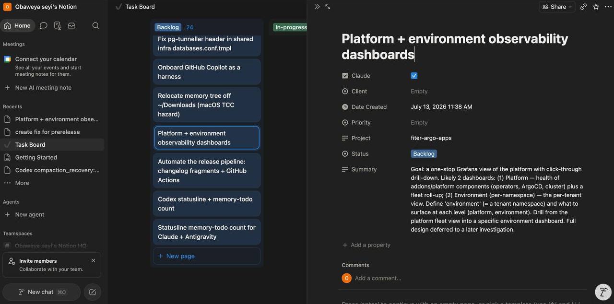

# Notion task provider (`NotionProvider`)

A remote backend that projects the task contract onto a Notion data source — same
contract as the [local provider](../local/README.md), zero changes to the
contract / CLI / factory / local code. Uses `urllib.request` only (no `requests`), talks
`Notion-Version: 2025-09-03`, and reads its secrets from the environment — **no secrets in
code or the tree**. All backend-specific strings are isolated to this folder's
`__init__.py`.



## Setup

### 1. Database schema

The target Notion data source must carry these properties (names are the constants in
`__init__.py`):

| Property | Type | Role |
|----------|------|------|
| `Name` | title | task title |
| `Summary` | rich text | the thin summary (refined Goal at `/start`) |
| `Project` | rich text (**not** select) | the memory project name — text so unknown projects validate rather than failing silently |
| `Status` | status **or** select | lifecycle — option names must match `status_map` (below) |
| `Claude` | checkbox | the **consume tag** — `list` only returns `Claude = true` rows, so your own cards stay invisible to the provider |
| `Created` | created time | optional — falls back to the page's `created_time` if absent |

> The Notion page **body is not part of the contract**. The provider reads and writes
> **properties only** — anything typed into the page body is silently ignored. Put design
> detail in `projects/<project>/investigations/<slug>.md` and name it from `Summary`.

### 2. Resolve `data_source_id` (not the database id)

In the 2025-09-03 API a database is a *container* of data sources; pages live in a data
source. Share the database with your integration first, then resolve the inner id once:

```bash
curl -s https://api.notion.com/v1/databases/<DATABASE_ID> \
  -H "Authorization: Bearer $NOTION_TOKEN" -H "Notion-Version: 2025-09-03" \
| python3 -c 'import sys,json; print([(x["id"],x.get("name")) for x in json.load(sys.stdin)["data_sources"]])'
```

Take the inner id → `NOTION_DATA_SOURCE_ID`. (Get the database id from the DB URL.)

### 3. Status mapping

`status_map` maps canonical → native option names: `backlog→Backlog`,
`started→In-progress`, `done→Done`, `archived→Archived`. Edit the map in `__init__.py` to
match your board's option labels. If your `Status` property is a **select** (not a Notion
*status*-type), set `NOTION_STATUS_KIND=select` (default `status`).

> **Notion API limitation:** you can *add* and *reorder* select options but **cannot
> rename or delete** them via the API (rename = add new + reorder + leave the old
> vestigial; delete is UI-only).

### 4. Environment

Selecting Notion is a per-machine env choice:

```bash
# put these in ~/.zshenv (NOT ~/.zshrc)
export MEMORY_TASK_PROVIDER=notion
export NOTION_STATUS_KIND=select          # only if Status is a select
export NOTION_DATA_SOURCE_ID=<data source id>
export NOTION_TOKEN=<integration secret>
```

> **Must be `~/.zshenv`, not `~/.zshrc`:** `/task` and `/start` run through Claude's Bash
> tool — a *non-interactive* zsh that sources `.zshenv` only. Env set in `.zshrc` is
> invisible to those commands.

Verify:

```bash
scripts/taskctl ping        # -> {"ok": true}
```

## Configuration

| Env var | Default | Role |
|---------|---------|------|
| `MEMORY_TASK_PROVIDER` | `local` | set to `notion` to select this backend |
| `NOTION_TOKEN` | — | integration secret (required) |
| `NOTION_DATA_SOURCE_ID` | — | target data source id (required) |
| `NOTION_STATUS_KIND` | `status` | `select` if `Status` is a select property |
| `NOTION_TEST_DATA_SOURCE_ID` | — | scratch data source for the gated live smoke test |

## Delete semantics

`delete` **trashes the Notion page** (`archived: true` at the API level), which is distinct
from setting the task's lifecycle `Status` to `archived`. The former removes the page; the
latter is a normal lifecycle transition that keeps the row.

See [`docs/task-provider.md`](../../../../docs/task-provider.md) for the full contract, the
CLI boundary, and the design rationale (backend as a projection, not a co-source of truth).
